# 📖 Konglish - 콩글리시

> 개발기간: 2025.05.30 - 2025.06.08 (약 10일)  
> 개발 인원: 1명 (개인 프로젝트)

## 프로젝트 소개

Konglish는 단어 학습 플랜을 만들고 단계별 학습을 통해 **사용자의 성장과 반복을 유도하는** 웹 기반 단어 암기 앱입니다.  
학습 목적의 웹페이지이기 때문에 딱딱함보다는 재미있고 자연스러운 인터렉션 중심의 학습 경험을 제공하고자 **모션 디자인을 활용하여 교육과 재미를 동시에 제공할 수 있도록 하였습니다.**

학습을 마친 사용자가 작은 성취감을 느끼고 자연스럽게 다음 학습으로 이어지도록 반복성과 리텐션 구조를 설계했으며,
결과적으로 매일 짧게 접속해도 꾸준히 학습이 이어질 수 있는 흐름을 만들어냈습니다.

📎 https://www.konglish.shop

> **테스트 계정**  
> id(email): test@email.com / pw: 1234
> <br/>

## 기술스택

| 분류             | 스택                                                    |
| ---------------- | ------------------------------------------------------- |
| Frontend         | Next.js 15, TypeScript Styled-Components, framer-motion |
| Backend          | Node.js, Express, MySQL                                 |
| Auth             | JWT-based 인증, Access/Refresh Token                    |
| State Management | Redux + redux-persist                                   |
| Infra            | Docker, EC2 + Nginx + GitHub Actions (CI/CD)            |

## Phase1. 앱처럼 자연스럽게 들어오고, 머물 수 있도록

"매번 웹 사이트에 접속해서 공부하는 거... 귀찮지 않을까?"  
그래서 **웹앱이지만 앱처럼 자연스럽고 익숙한 사용 경험** 을 구현하는 것을 목표로 했습니다.

### 🪄 앱처럼 보이는 전환 애니메이션

페이지 전환 시 `framer-motion`을 활용하여 slide in/out 애니메이션을 적용하였고, 이를 통해 실제 앱처럼 부드러운 화면 전환과 **몰입감 있는 흐름** 을 구현하고자 했습니다.

```js
<AnimatePresence mode="wait">
  <motion.div initial={{ x: '100%' }} animate={{ x: 0 }} exit={{ x: '-100%' }}>
    {children}
  </motion.div>
</AnimatePresence>
```

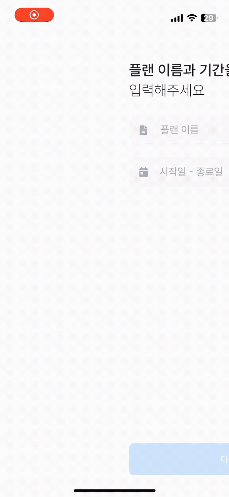
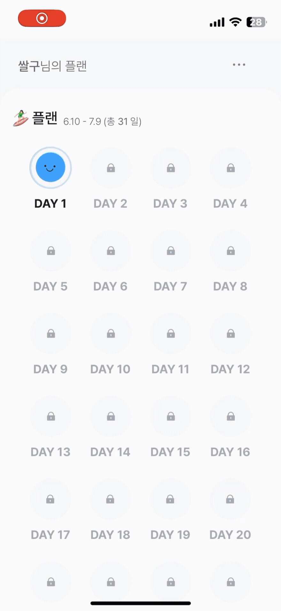

### 📲 A2HS (Add to Home Screen) 적용

또한 사용자가 앱처럼 사용할 수 있도록 **홈 화면 추가(Install App)** 를 유도했습니다.

- Android는 `beforeinstallprompt` 이벤트를 감지해 설치 배너를 보여주고,
- iOS는 `navigator.standalone`을 체크해 별도의 설치 가이드를 제공합니다.

이 부분은 `useA2HS()` 커스텀 훅으로 분리하여 환경에 따라 최적의 UX를 조건부 렌더링 할 수 있도록 만들었습니다.  
결과적으로 홈화면에 추가하면:

- 풀 스크린 모드로 실행되고,
- 앱 진입 아이콘이 생성되며,
- 로딩 없이 빠르게 진입할 수 있어

웹앱이지만 실제 앱처럼 **일관된 사용 경험**을 제공합니다.

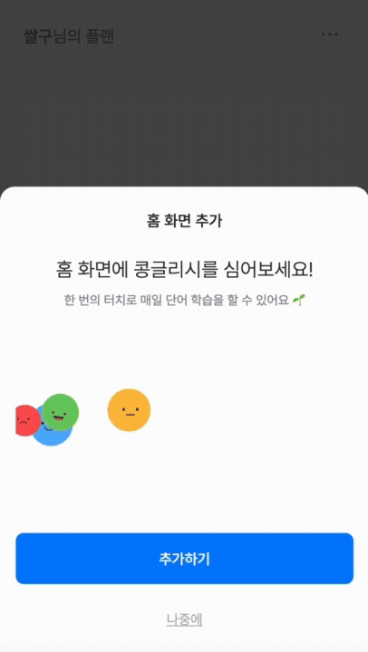
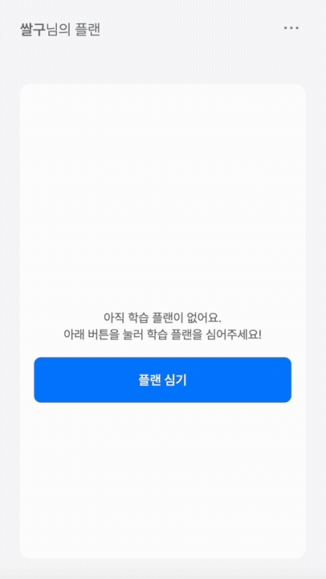

## Phase2. 재미와 몰입을 유도하는 학습 구조

반복적인 단어 학습은 쉽게 지루해질 수 있다고 생각했습니다.
그래서 **조금이라도 더 재미있고, 조금이라도 더 기억에 남는 방식**으로 학습을 구성하고자 했습니다.

단순 반복이 아닌 **몰입 → 확인 → 입력 → 피드백 → 반복**의 사이클을 설계함으로써 사용자가 흐름을 따라가다 보면 자연스럽게 복습이 이루어지는 구조를 목표로 했습니다.

### 📚 Practice 1 - 단어 살펴보기

- 학습 시작 단계로, 단어 리스트(뜻, 발음, 품사)를 제공합니다.
- 발음 듣기 기능은 `dictionaryapi.dev`에서 데이터를 비동기로 요청하고, 해당 단어의 발음 오디오를 재생합니다.
- `audioRef`를 통해 재생 상태를 제어하며, 불필요한 중복 재생을 방지했습니다.

```js
const handlePhonetic = async (word: string) => {
  const res = await fetch(...);
  const audio = new Audio(audioUrl);
  audio.play();
};
```

<details><summary>Practice 1 보기</summary>
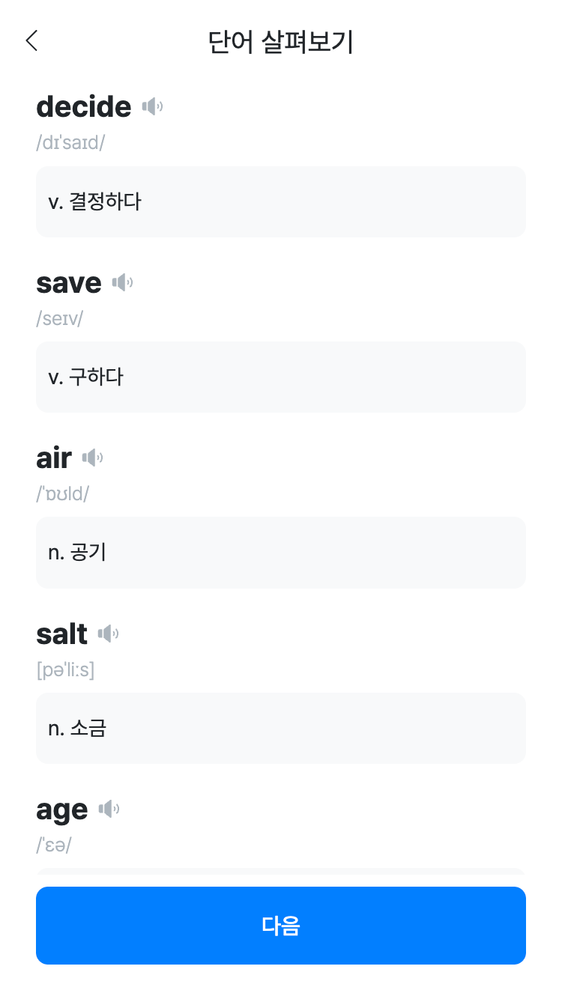
</details>

### 📚 Practice 2 - 객관식 퀴즈 + 피드백

- 각 단어에 대해 4개의 보기를 생성하고 정답과 함께 무작위로 섞어 렌더링합니다.
- 정답 클릭 시 애니메이션 피드백과 함께 점수가 누적되고, great 상태값을 증가시킵니다.
- 문제 전환은 `setTimeout` 기반으로 이루어지며, `isTransitioning` 상태를 활용해 중복 클릭 방지 및 부드러운 문제 전환 흐름을 구현했습니다.

```js
if (correct === choice) {
  setGreat(prev => prev + 1);
}
```

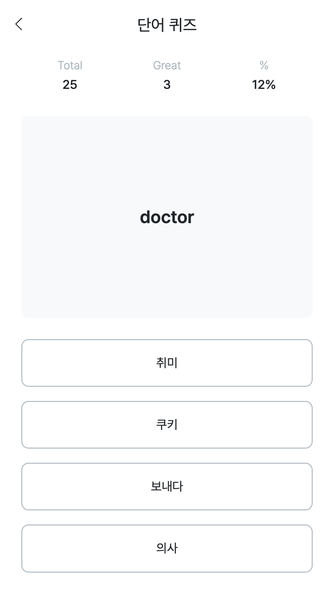
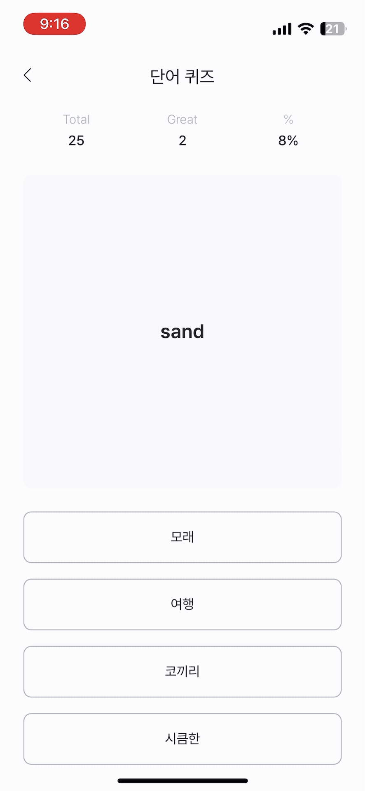

### 📚 Practice 2.5 - 감정 기반 성취도 피드백

- 퀴즈가 끝난 후 단순한 점수 대신 정답률에 따라 Lottie 애니메이션 기반 이모지 피드백을 제공합니다.
- 이 피드백은 BottomSheet 컴포넌트 안에서 조건부 렌더링되어, 결과에 따라 다른 감정 상태를 전달했습니다.

```js
{
  percentage < 30 ? <Angry /> : percentage < 70 ? <Neutral /> : <Delighted />;
}
```

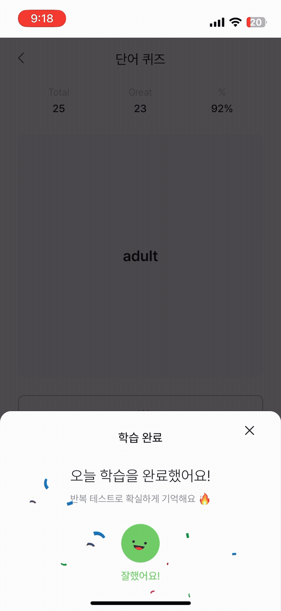
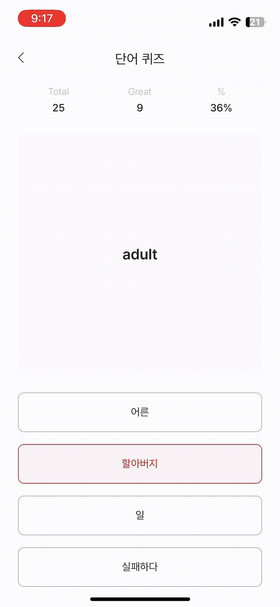
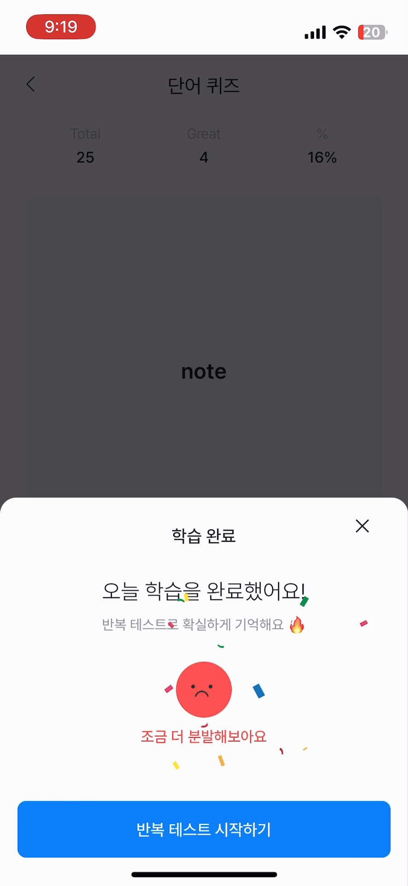

### 📚 Practice 3 - 타이핑 기반 반복 학습

- 학습 흐름의 마지막 단계는 사용자가 직접 단어의 뜻을 입력하는 타이핑 기반 반복 학습으로 구성했습니다.
- 제한 시간 내에 뜻을 입력하는 퀴즈로 기억을 능동적으로 떠올려 입력하는 과정을 통해 회상 효과를 극대화하고자 했습니다.
- `useReducer`로 상태를 명확히 분리하여 `stage`, `timer`, `currentIndex`, `answerList` 등을 관리합니다.
- 타이머는 `useRef`로 관리하여 불필요한 렌더링을 막고, 입력 제출(Enter 또는 타이머 종료 시) 후 다음 문제로 자동 전환됩니다.

```js
const reducer = (state, action) => {
  switch (action.type) {
    case 'TICK_COUNT':
      return { ...state, count: state.count - 1 };
    case 'START_TEST':
      return { ...state, stage: 1, timer: 10 };
    case 'SUBMIT_ANSWER':
      return {
        ...state,
        answerList: [...state.answerList, action.payload],
        answer: '',
      };
    case 'NEXT_QUESTION':
      return { ...state, currentIndex: state.currentIndex + 1 };
    case 'FINISH_TEST':
      return { ...state, stage: 2 };
    default:
      return state;
  }
};

const [state, dispatch] = useReducer(reducer, initialState);
```

#### (+) 흐름 요약

| 단계 | 설명                                         |
| ---- | -------------------------------------------- |
| 준비 | 5초 카운트다운 후 자동 시작                  |
| 입력 | 단어가 주어지고 제한시간(10초) 내에 뜻 입력  |
| 제출 | 시간 초과 or Enter 입력 시 정답 제출         |
| 반복 | 다음 문제로 자연스럽게 전환                  |
| 결과 | 입력한 답안과 실제 뜻을 비교하는 결과표 제공 |

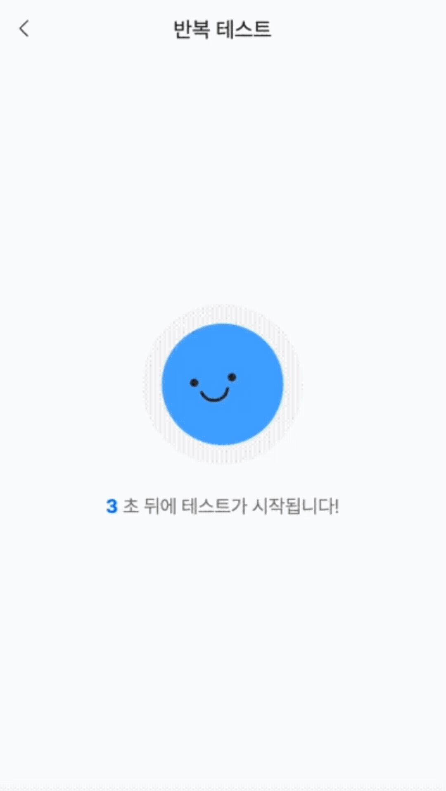

### 📚 기타 - 학습(플랜) 종료

- 모든 학습 완료 시 단순한 "완료 메시지"가 아닌 **플랜(트)를 심고 키운 결과물**을 귀여운 3D 모델로 시각화했습니다.
- `@react-three/fiber`와 `@react-three/drei`를 활용해 구성했으며, Canvas 컴포넌트와 OrbitControls를 통해 3D로 시각화했습니다.

```js
<Canvas style={{ width: '100%', height: '200px' }} camera={{ position: [0, 2, 4], fov: 35 }}>
  <ambientLight intensity={1} />
  <directionalLight position={[2, 2, 2]} />
  <Avocado />
  <OrbitControls enableZoom={false} enablePan={false} autoRotate={false} target={[0.06, 0.5, 0]} />
</Canvas>
```

- 단어 암기라는 반복 작업에 감정적 피드백, 인터랙션, 보상 요소를 더해 사용자 리텐션을 강화했습니다.
- `dynamic import`와 `useMemo`를 활용해 클라이언트 사이드에서도 성능 저하 없이 3D 모델을 안정적으로 렌더링할 수 있도록 구성했습니다.

```js
const MyCarrot = dynamic(() => import('@/component/Common/Model/Carrot'), { ssr: false });
const MyCorn = dynamic(() => import('@/component/Common/Model/Corn'), { ssr: false });

...

```

- 사용자가 학습을 마칠 때마다 다른 보상 모델이 보이도록, `useMemo`를 활용해 초기 렌더링 시 한 번만 랜덤 모델을 선택하는 방식으로 처리했습니다.

```js
const randomPlant = useMemo(() => {
  const idx = Math.floor(Math.random() * plantOptions.length);
  return plantOptions[idx];
}, []);
```

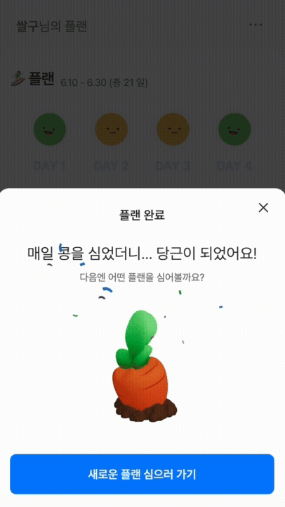
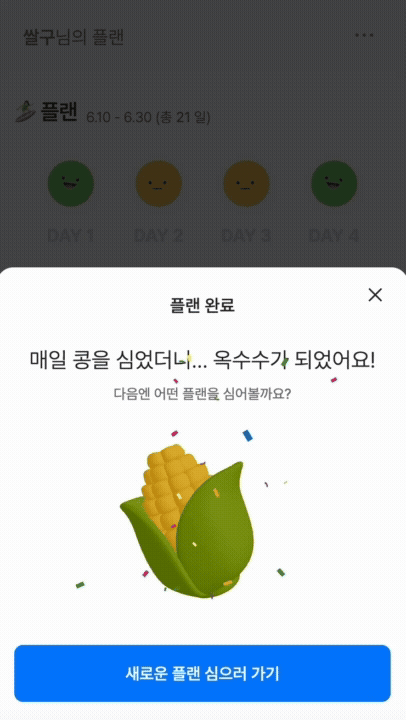
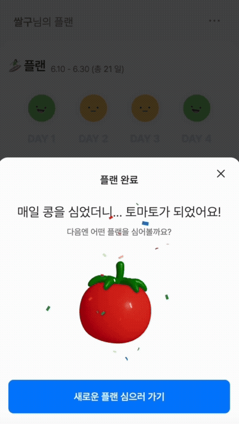

<details><summary>채소 더 보기 👀</summary>
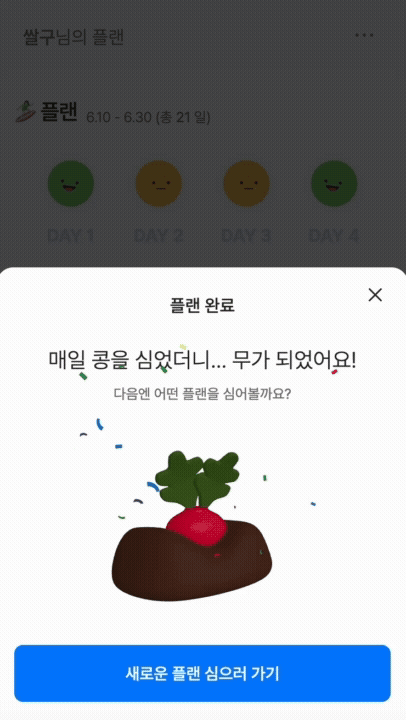
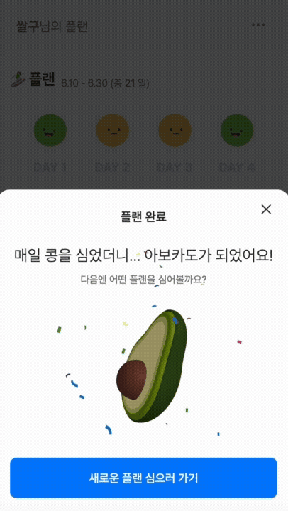
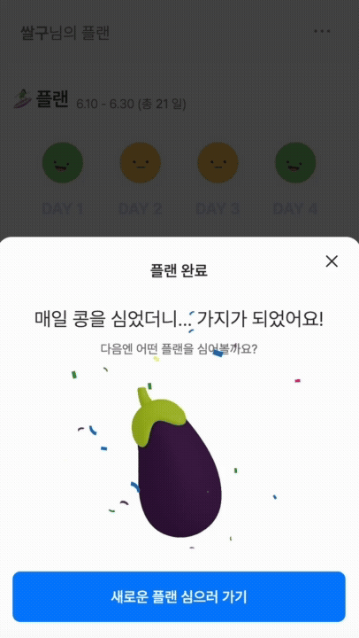
</details>

## Phase 3. 끊김 없는 인증 흐름 구현

단어 학습 앱은 **매일 접속**하고, **짧게 머무는 사용성**이 많습니다.  
그런데 매번 로그인 액션이 이루어져야한다면 그 자체가 진입 장벽이 된다고 생각했습니다.
그래서 사용자는 로그인 상태를 인식하지 않으면서도, 백에선 안전하게 인증이 유지되도록 설계했습니다.

### 🔐 구조 요약

- 로그인 시 서버에서 `access_token`, `refresh_token`을 **HTTP Only 쿠키**로 발급합니다.
- 프론트에서는 `axios` 요청마다 쿠키를 자동으로 포함시킵니다. (`withCredentials: true`)
- access token이 만료되면, Axios 인터셉터가 자동으로 `/refresh-token` 요청 후 원래 요청을 재시도합니다.

```js
const instance = axios.create({
  baseURL: process.env.NEXT_PUBLIC_APP_API_KEY,
  withCredentials: true,
});

instance.interceptors.response.use(
  response => response,
  async error => {
    const originalRequest = error.config;

    if (
      error.response?.status === 401 &&
      error.response?.data?.errorCode === 'EXPIRED_ACCESS_TOKEN' &&
      !originalRequest._retry
    ) {
      originalRequest._retry = true;
      await instance.get('/v1/auth/refresh-token');
      return instance(originalRequest);
    }

    return Promise.reject(error);
  },
);
```

## Phase4. 학습 상태를 지속적으로 관리하기

단어 학습에서는 사용자의 상태가 빠르게 바뀌고 여러 컴포넌트가 이 상태를 동시에 공유해야 합니다.  
이를 안정적으로 관리하기 위해 `Redux + Redux-Saga + Redux-Persist` 조합을 사용했습니다.

### 💾 사용자 인증 상태 관리(AuthState + Saga)

- 로그인/회원가입 흐름은 `Redux-Saga`를 통해 비동기적으로 처리
- **access/refresh token**을 서버에 저장한 뒤, 사용자 정보는 Redux에 저장
- 또한, `redux-persist`를 활용해 새로고침 시에도 로그인 상태가 유지되도록 구성

```js
// 로그인 요청
yield call(axios.post, '/v1/auth/signin', action.payload, { withCredentials: true });

// 사용자 정보 가져오기
const res: any = yield call(axios.get, '/v1/auth/user', { withCredentials: true });
yield put(success(res.data.data));
```

### 💿 새로고침에도 유지되는 상태 - redux-persist

학습 도중 새로고침으로 인해 데이터가 사라지는 UX를 방지하기 위해 `redux-persist`를 적용해 상태를 `localStorage`에 저장하고, 앱과 자동으로 동기화되도록 설정했습니다.

```js
const persistConfig = {
  key: 'root',
  storage,
  whitelist: ['day', 'user'],
};
```

### 페이지 전환 시 전역 로딩 처리

- 전역에서 로딩 상태를 감지할 수 있도록 Redux로 분리
- Next.js의 router 이벤트를 감지해서 공통 로딩 처리를 구성
  - `_app.tsx`에 `RouteLoadingHandler` 컴포넌트를 추가
  - `router.events`로 `routeChangeStart`/`Complete` 이벤트에 Redux 상태를 연동

```js
router.events.on('routeChangeStart', () => dispatch(setLoading(true)));
```
